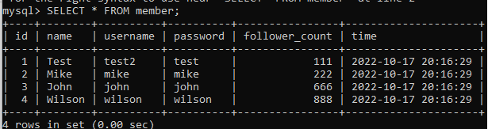

# Assignment - Week 5

### 要求⼀：安裝 MySQL 伺服器

### 要求⼆：建立資料庫和資料表

1. 建立⼀個新的資料庫，取名字為 website 。

   `CREATE DATABASE website`

2. 在資料庫中，建立會員資料表，取名字為 member 。資料表必須包含以下欄位設定：
   

   ` CREATE TABLE member(id INT PRIMARY KEY AUTO_INCREMENT, name VARCHAR(255) NOT NULL, username VARCHAR(255) NOT NULL, password VARCHAR(255) NOT NULL, follower_count INT UNSIGNED NOT NULL DEFAULT 0, time DATETIME NOT NULL );`

   

## 要求三：SQL CRUD

利⽤要求⼆建立的資料庫和資料表，寫出能夠滿⾜以下要求的 SQL 指令：

- 使⽤ INSERT 指令新增⼀筆資料到 member 資料表中，這筆資料的 username 和 password 欄位必須是 test。接著繼續新增⾄少 4 筆隨意的資料。

  `INSERT INTO member ('Test', 'test', 'test', 999);`

- 使⽤ SELECT 指令取得所有在 member 資料表中的會員資料。

  `SELECT * FROM member;`

  

- 使⽤ SELECT 指令取得所有在 member 資料表中的會員資料，並按照 time 欄位，由近到遠排序。

  `SELECT * FROM member ORDER BY time;`

  

- 使⽤ SELECT 指令取得 member 資料表中第 2 ~ 4 共三筆資料，並按照 time 欄位，
  由近到遠排序。 ( 並非編號 2、3、4 的資料，⽽是排序後的第 2 ~ 4 筆資料 )

  `SELECT * FROM member ORDER BY time LIMIT 1, 3; `
  

* 使⽤ SELECT 指令取得欄位 username 是 test 的會員資料。

  `SELECT username FROM username = 'test';`

  

* 使⽤ SELECT 指令取得欄位 username 是 test、且欄位 password 也是 test 的資料。

  `SELECT * FROM member WHERE username= 'test' and password= 'test'; `
  

* 使⽤ UPDATE 指令更新欄位 username 是 test 的會員資料，將資料中的 name 欄位改
  成 test2。

      `UPDATE member SET username= 'test2' WHERE username='test'; `

  

## 要求四：SQL Aggregate Functions

- 取得 member 資料表中，總共有幾筆資料 ( 幾位會員 )。
  `SELECT COUNT(*) FROM member ;`

  

- 取得 member 資料表中，所有會員 follower_count 欄位的總和。

  `SELECT SUM(follower_count) FROM member; `

  

- 取得 member 資料表中，所有會員 follower_count 欄位的平均數。

  `SELECT AVG(follower_count) FROM member;`

  

  
