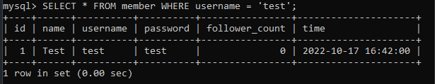

# Assignment - Week 5

### 要求⼀：安裝 MySQL 伺服器

### 要求⼆：建立資料庫和資料表

1. 建立⼀個新的資料庫，取名字為 website 。

   `CREATE DATABASE website`

2. 在資料庫中，建立會員資料表，取名字為 member 。資料表必須包含以下欄位設定：
   

   ` CREATE TABLE member(id INT PRIMARY KEY AUTO_INCREMENT, name VARCHAR(255) NOT NULL, username VARCHAR(255) NOT NULL, password VARCHAR(255) NOT NULL, follower_count INT UNSIGNED NOT NULL DEFAULT 0, time DATETIME NOT NULL );`

   

### 要求三：SQL CRUD

利⽤要求⼆建立的資料庫和資料表，寫出能夠滿⾜以下要求的 SQL 指令：

- 使⽤ INSERT 指令新增⼀筆資料到 member 資料表中，這筆資料的 username 和 password 欄位必須是 test。接著繼續新增⾄少 4 筆隨意的資料。

  `INSERT INTO member ('Test', 'test', 'test', 999);`

- 使⽤ SELECT 指令取得所有在 member 資料表中的會員資料。

  `SELECT * FROM member;`

  

- 使⽤ SELECT 指令取得所有在 member 資料表中的會員資料，並按照 time 欄位，由近到遠排序。

  `SELECT * FROM member ORDER BY time;`

  

- 使⽤ SELECT 指令取得 member 資料表中第 2 ~ 4 共三筆資料，並按照 time 欄位，
  由近到遠排序。 ( 並非編號 2、3、4 的資料，⽽是排序後的第 2 ~ 4 筆資料 )

  `SELECT * FROM member ORDER BY time LIMIT 1, 3; `
  

* 使⽤ SELECT 指令取得欄位 username 是 test 的會員資料。

  `SELECT username FROM username = 'test';`

  

* 使⽤ SELECT 指令取得欄位 username 是 test、且欄位 password 也是 test 的資料。

  `SELECT * FROM member WHERE username= 'test' and password= 'test'; `
  

* 使⽤ UPDATE 指令更新欄位 username 是 test 的會員資料，將資料中的 name 欄位改
  成 test2。

      `UPDATE member SET username= 'test2' WHERE username='test'; `

  

### 要求四：SQL Aggregate Functions

- 取得 member 資料表中，總共有幾筆資料 ( 幾位會員 )。

  `SELECT COUNT(*) FROM member ;`

  

- 取得 member 資料表中，所有會員 follower_count 欄位的總和。

  `SELECT SUM(follower_count) FROM member; `

  

- 取得 member 資料表中，所有會員 follower_count 欄位的平均數。

  `SELECT AVG(follower_count) FROM member;`

  

  

### 要求五：SQL JOIN (Optional)

#### 1. 在資料庫中，建立新資料表紀錄留⾔資訊，取名字為 message 。資料表中必須包含以下欄位設定：

`CREATE TABLE message (id BIGINT PRIMARY KEY AUTO_INCREMENT,member_id BIGINT NOT NULL, content VARCHAR(255) NOT NULL, like_count INT_UNSIGNED NOT NULL DEFAULT 0, time DATETIME NOT NULL DEFAULT CURRENT_TIMESTAMP , FOREIGN KEY(member_id) REFERENCES member(id));`

- 使⽤ SELECT 搭配 JOIN 語法，取得所有留⾔，結果須包含留⾔者會員的姓名。

  `SELECT * FROM member INNER JOIN message ON member.id = message.member_id;`
  

- 使⽤ SELECT 搭配 JOIN 語法，取得 member 資料表中欄位 username 是 test 的所有留⾔，資料中須包含留⾔者會員的姓名。

  `SELECT * FROM member INNER JOIN message ON member.id = message.member_id WHERE username='test';`
  

- 使⽤ SELECT、SQL Aggregate Functions 搭配 JOIN 語法，取得 member 資料表中欄位 username 是 test 的所有留⾔平均按讚數。

  `SELECT AVG(like_count) FROM member INNER JOIN message ON member.id= message_id WHERE username = 'test`;
  

### 我們不只要記錄留言按讚的數量，還要紀錄每一個留言的按讚會員是誰，支援以下使用場合：

- 可以根據留言編號取得該留言有哪些會員按讚。

`CREATE TABLE content_like( message_id BIGINT, member_id BIGINT, PRIMARY KEY (message_id, member_id), foreign key(message_id) REFERENCE message(id) ON DELETE CASCADE );`

`ALTER TABLE content_like ADD FOREIGN KEY(member_id) REFERENCES member(id);`

`INSERT INTO content_like(message_id, member_id) VALUES(2, 1);`

`INSERT INTO content_like(message_id, member_id) VALUES(2, 2);`

`INSERT INTO content_like(message_id, member_id) VALUES(2, 4);`

`SELECT message_id FROM content_like WHERE message_id = 2;`

- 會員若是嘗試對留言按讚：要能先檢查是否曾經按過讚，然後才將按讚的數量 +1 並且記錄按讚的會員是誰。

檢查是誰按了第二則留言，抓出姓名

計算某一則訊息的按讚數量

